# Lab 4: Carga y Renderizado de Modelos OBJ

Implementación de un renderer 3D por software desarrollado desde cero en Rust con `raylib`, capaz de leer y parsear archivos Wavefront `.obj` triangulados, proyectar su geometría y dibujar todos sus triángulos en wireframe sobre un framebuffer propio en memoria.

---

## Comparativa de Resultados: Blender vs. Renderizado por Software

Se exportaron **6 planos de proyección ortogonal** de la nave (Frontal, Trasera, Lateral Derecha, Lateral Izquierda, Superior e Inferior) variando los ejes de orientación (*Forward* y *Up*) en Blender, para contrastar la vista sólida/perspectiva de referencia frente a las primitivas rasterizadas por software con el algoritmo de Bresenham:

### 1. Vista Frontal (`Nave_X_Y.obj`)
> *Forward: +X, Up: +Y*

| Modelo en Blender (Frontal) | Renderizado por Software (`render_X_Y.png`) |
| :---: | :---: |
| 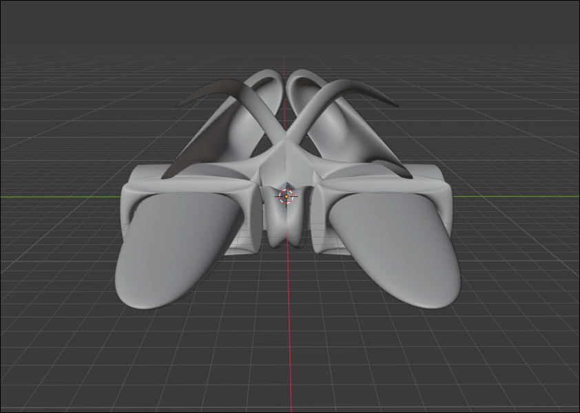 | 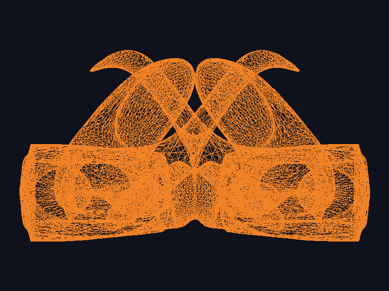 |

### 2. Vista Posterior / Trasera (`Nave_-X_Y.obj`)
> *Forward: -X, Up: +Y*

| Modelo en Blender (Trasera) | Renderizado por Software (`render_-X_Y.png`) |
| :---: | :---: |
| 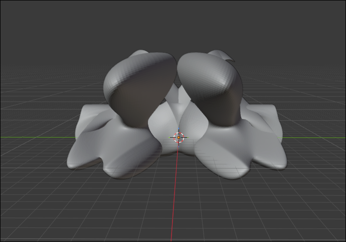 | 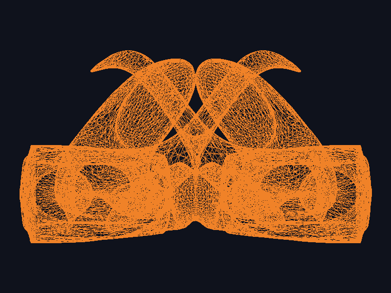 |

### 3. Vista Lateral Derecha (`Nave_Z_Y.obj`)
> *Forward: +Z, Up: +Y*

| Modelo en Blender (Lateral Derecha) | Renderizado por Software (`render_Z_Y.png`) |
| :---: | :---: |
| 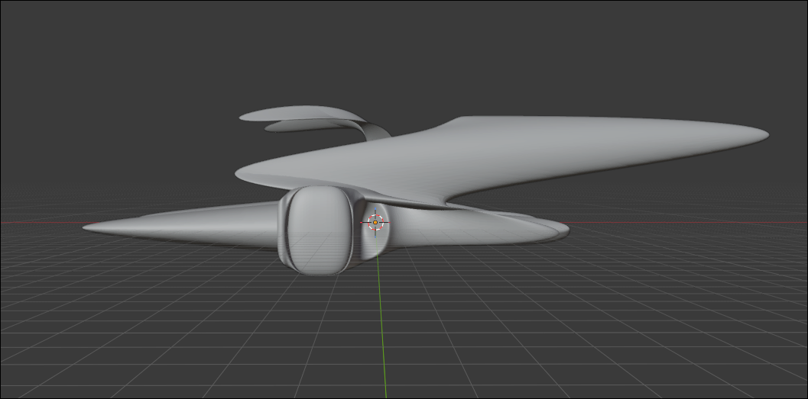 | 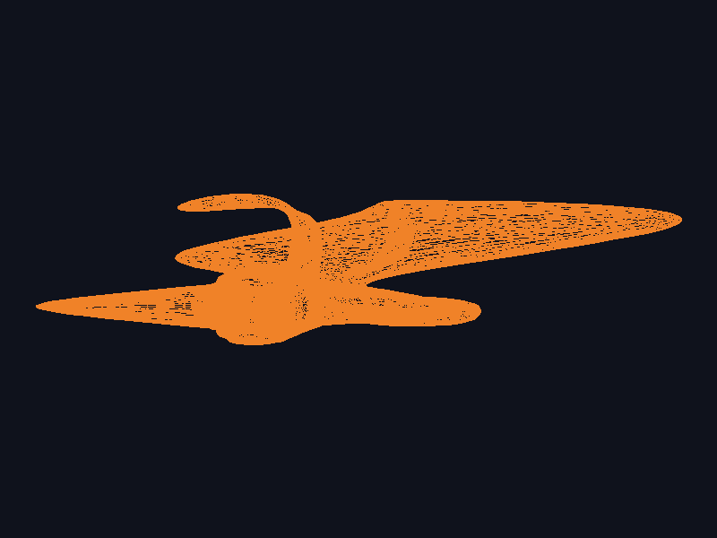 |

### 4. Vista Lateral Izquierda (`Nave_-Z_Y.obj`)
> *Forward: -Z, Up: +Y*

| Modelo en Blender (Lateral Izquierda) | Renderizado por Software (`render_-Z_Y.png`) |
| :---: | :---: |
| 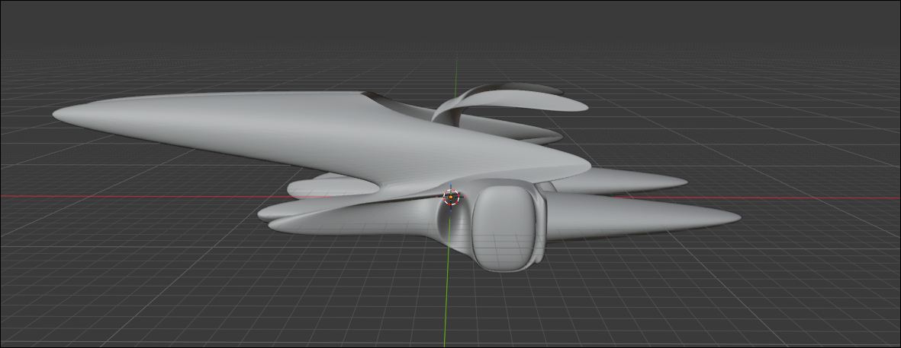 | 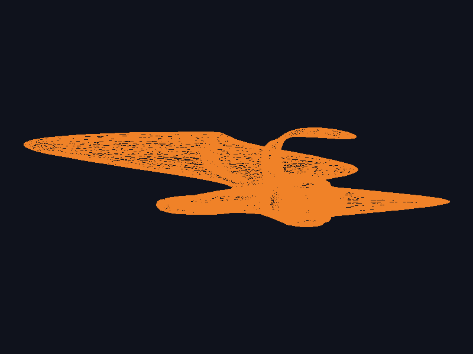 |

### 5. Vista Superior / Planta (`Nave_X_Z.obj`)
> *Forward: +X, Up: +Z*

| Modelo en Blender (Superior) | Renderizado por Software (`render_X_Z.png`) |
| :---: | :---: |
| 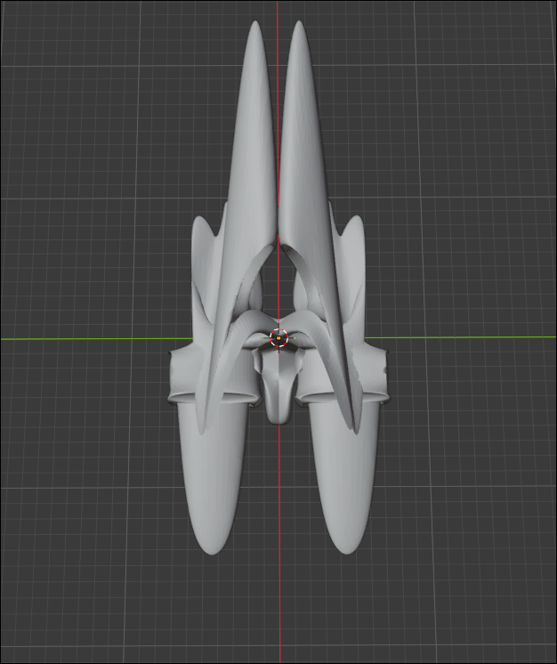 | 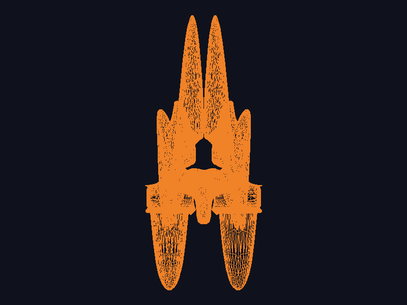 |

### 6. Vista Inferior / Base (`Nave_X_-Z.obj`)
> *Forward: +X, Up: -Z*

| Modelo en Blender (Inferior) | Renderizado por Software (`render_X_-Z.png`) |
| :---: | :---: |
| 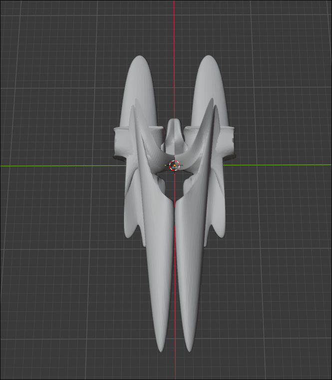 | 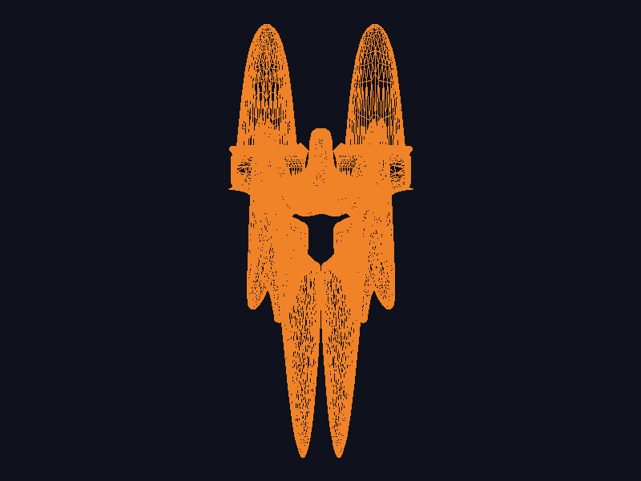 |

---

## Descripción

El proyecto implementa un pipeline gráfico completo por software para la visualización de mallas poligonales 3D, sin depender de librerías externas de carga de modelos ni de las funciones de renderizado 3D de raylib:

- **Parser manual de archivos `.obj`:** Lee línea por línea reconociendo vértices de posición (`v`) y caras trianguladas (`f`), convirtiendo los índices base 1 del estándar Wavefront a índices base 0 para almacenamiento en memoria de Rust. También soporta caras con atributos adicionales (`v/vt/vn` o `v//vn`) filtrando exclusivamente el índice geométrico.
- **Proyección 2D y transformación a pantalla:** Transforma las coordenadas 3D $(x, y, z)$ a coordenadas de pantalla 2D $(x_p, y_p)$ mediante escalado y traslación, invirtiendo el eje $Y$ para compensar la diferencia entre el sistema cartesiano de modelado ($Y$ hacia arriba) y el sistema de rasterizado de pantalla ($Y$ hacia abajo).
- **Ajuste y centrado automático (*Fit to Screen*):** Calcula el *bounding box* mínimo y máximo del modelo mediante el método `bounds()`, determinando una escala uniforme y un desplazamiento (*offset*) que garantiza que el objeto quede centrado y completamente visible dentro del framebuffer con un margen de seguridad del 10%.
- **Rasterizado de primitivas con Bresenham:** Dibuja las aristas de cada triángulo conectando sus tres vértices ($A \to B \to C \to A$) mediante el algoritmo clásico de trazado de líneas de Bresenham sobre un búfer de píxeles propio.
- **Color y contraste visual:** Renderizado de líneas wireframe con tono naranja cálido (`Color::new(240, 130, 40, 255)`) sobre un fondo oscuro (`Color::new(15, 18, 28, 255)`) para máxima legibilidad de mallas densas.
- **Exportación organizada por lotes:** Procesa y genera automáticamente las 6 vistas ortogonales dentro del directorio `images/`.

---

## Cómo correr el proyecto

### Requisitos

- **Rust + Cargo** (edición 2024 o versión moderna instalada).
- Herramientas de compilación de C y CMake (requeridas para compilar el crate `raylib-sys`).

### Build y ejecución

**Modo automático (renderiza las 6 vistas ortogonales de la nave):**
```bash
cargo run --release
```
Generará automáticamente dentro de `images/`:
- `render_X_Y.png`
- `render_-X_Y.png`
- `render_Z_Y.png`
- `render_-Z_Y.png`
- `render_X_Z.png`
- `render_X_-Z.png`
- `render.png` (copia de la vista principal)

**Modo archivo individual:**
```bash
cargo run --release -- assets/Nave_X_Y.obj images/output_personalizado.png
```
O con el modelo de prueba cúbico:
```bash
cargo run --release -- assets/cube.obj
```

> **NOTA DE RENDIMIENTO:** Cada modelo de la nave contiene **14,811 vértices** y **29,696 triángulos** (~89,088 llamadas a líneas de Bresenham). En modo `--release`, gracias a las optimizaciones del compilador de Rust, la carga y el renderizado completo de cada vista toma apenas **~8 - 11 ms** (~54 ms para las 6 vistas en total).

---

## Dependencias principales

- [`raylib`](https://crates.io/crates/raylib) — Utilizado estrictamente para tipos de datos geométricos (`Color`, `Vector2`, `Vector3`) y para la exportación final del búfer de píxeles a archivo mediante `Image::export_image`.

---

## Pipeline de Renderizado

```
Archivo .OBJ
    ↓
Parser manual (load_obj): extracción de Vec<Vector3> e índices Vec<usize>
    ↓
Cálculo de Bounding Box (obj.bounds()) y parámetros de pantalla (fit_to_screen)
    ↓
Proyección de vértices a 2D (to_screen con inversión de Y)
    ↓
Descomposición en triángulos (chunks_exact(3))
    ↓
Trazado de aristas con algoritmo de Bresenham (triangle → line)
    ↓
Escritura de píxeles en memoria (Framebuffer::set_pixel)
    ↓
Exportación de imágenes PNG a images/ (render_X_Y.png, render_-X_Y.png, etc.)
```

---

## Estructura del proyecto

```
.
├── README.md           # Documentación del proyecto, pipeline y 6 comparativas
├── Cargo.toml          # Configuración del crate, optimizaciones y dependencias
├── Cargo.lock          # Versiones bloqueadas de dependencias
├── assets/
│   ├── Nave_X_Y.obj    # Malla vista frontal (Forward: +X, Up: +Y)
│   ├── Nave_-X_Y.obj   # Malla vista trasera (Forward: -X, Up: +Y)
│   ├── Nave_Z_Y.obj    # Malla vista lateral der. (Forward: +Z, Up: +Y)
│   ├── Nave_-Z_Y.obj   # Malla vista lateral izq. (Forward: -Z, Up: +Y)
│   ├── Nave_X_Z.obj    # Malla vista superior (Forward: +X, Up: +Z)
│   ├── Nave_X_-Z.obj   # Malla vista inferior (Forward: +X, Up: -Z)
│   └── cube.obj        # Modelo 3D básico de prueba (cubo de 8 vértices y 12 triángulos)
├── images/
│   ├── blender_X_Y.png   # Captura Blender vista frontal
│   ├── blender_-X_Y.png  # Captura Blender vista trasera
│   ├── blender_Z_Y.png   # Captura Blender vista lateral der.
│   ├── blender_-Z_Y.png  # Captura Blender vista lateral izq.
│   ├── blender_X_Z.png   # Captura Blender vista superior
│   ├── blender_X_-Z.png  # Captura Blender vista inferior
│   ├── render_X_Y.png    # Render wireframe por software frontal
│   ├── render_-X_Y.png   # Render wireframe por software trasero
│   ├── render_Z_Y.png    # Render wireframe por software lateral der.
│   ├── render_-Z_Y.png   # Render wireframe por software lateral izq.
│   ├── render_X_Z.png    # Render wireframe por software superior
│   ├── render_X_-Z.png   # Render wireframe por software inferior
│   └── render.png        # Copia del render frontal principal
src/
├── main.rs             # Punto de entrada, soporte batch/CLI, validaciones y ejecución
├── framebuffer.rs      # Búfer de píxeles en memoria, set_pixel y exportación
├── line.rs             # Algoritmo de líneas de Bresenham y función triangle
├── obj.rs              # Parser manual de OBJ (v, f) y cálculo de bounding box (bounds)
└── render.rs           # to_screen, fit_to_screen, LINE_COLOR y render_obj
```

---

## Limitaciones actuales

- **Proyección ortográfica básica:** Se toman directamente las componentes $X$ e $Y$ sin aplicar matrices de perspectiva ni división por $W$.
- **Renderizado wireframe:** Solo se trazan las aristas de los triángulos, sin soporte actual para rasterizado de caras sólidas ni sombreado (*shading*).
- **Sin eliminación de caras ocultas:** No se cuenta con *Z-buffer* ni descarte de caras traseras (*backface culling*), por lo que se dibujan todas las caras sin importar su oclusión o profundidad.

---

## Autor

**Marcelo Detlefsen** - Carné 24554  
*Universidad del Valle de Guatemala*  
*Gráficas por Computadora - Laboratorio 4*
