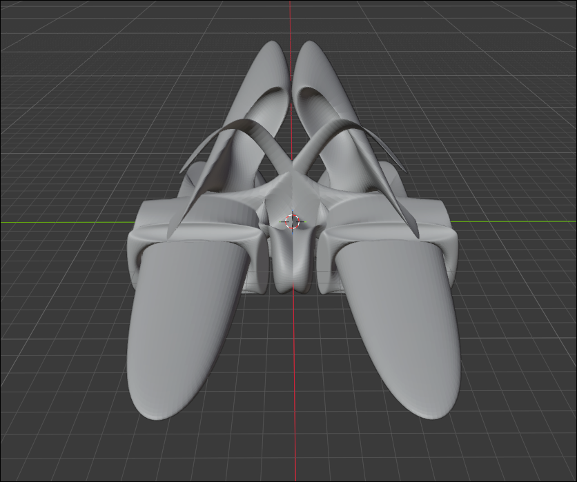

# Lab 4: Carga y Renderizado de Modelos OBJ

Implementación de un renderer 3D por software desarrollado desde cero en Rust con `raylib`, capaz de leer y parsear archivos Wavefront `.obj` triangulados, proyectar su geometría y dibujar todos sus triángulos en wireframe sobre un framebuffer propio en memoria.

### Comparativa de Resultados

| Modelo en Blender | Renderizado por Software (Rust) |
| :---: | :---: |
|  |  |

## Descripción

El proyecto implementa un pipeline gráfico completo por software para la visualización de mallas poligonales 3D, sin depender de librerías externas de carga de modelos ni de las funciones de renderizado 3D de raylib:

- **Parser manual de archivos `.obj`:** Lee línea por línea reconociendo vértices de posición (`v`) y caras trianguladas (`f`), convirtiendo los índices base 1 del estándar Wavefront a índices base 0 para almacenamiento en memoria de Rust. También soporta caras con atributos adicionales (`v/vt/vn` o `v//vn`) filtrando exclusivamente el índice geométrico.
- **Proyección 2D y transformación a pantalla:** Transforma las coordenadas 3D $(x, y, z)$ a coordenadas de pantalla 2D $(x_p, y_p)$ mediante escalado y traslación, invirtiendo el eje $Y$ para compensar la diferencia entre el sistema cartesiano de modelado ($Y$ hacia arriba) y el sistema de rasterizado de pantalla ($Y$ hacia abajo).
- **Ajuste y centrado automático (*Fit to Screen*):** Calcula el *bounding box* mínimo y máximo del modelo mediante el método `bounds()`, determinando una escala uniforme y un desplazamiento (*offset*) que garantiza que el objeto quede centrado y completamente visible dentro del framebuffer con un margen de seguridad del 10%.
- **Rasterizado de primitivas con Bresenham:** Dibuja las aristas de cada triángulo conectando sus tres vértices ($A \to B \to C \to A$) mediante el algoritmo clásico de trazado de líneas de Bresenham sobre un búfer de píxeles propio.
- **Exportación directa:** El búfer de color resultante se exporta automáticamente a `render.png`.

---

## Cómo correr el proyecto

### Requisitos

- **Rust + Cargo** (edición 2024 o versión moderna instalada).
- Herramientas de compilación de C y CMake (requeridas para compilar el crate `raylib-sys`).

### Build y ejecución

Para ejecutar con el modelo por defecto (`assets/Nave.obj`):
```bash
cargo run --release
```

Para ejecutar con cualquier otro modelo `.obj` pasado como argumento de línea de comandos:
```bash
cargo run --release -- assets/cube.obj
```

> **NOTA DE RENDIMIENTO:** El modelo de la nave contiene **59,362 vértices** y **118,784 triángulos** (~356,352 llamadas a líneas de Bresenham). En modo `--release`, gracias a las optimizaciones del compilador de Rust, la carga y el renderizado completo toman apenas **~35 ms**.

---

## Dependencias principales

- [`raylib`](https://crates.io/crates/raylib) — Utilizado estrictamente para tipos de datos geométricos (`Color`, `Vector2`, `Vector3`) y para la exportación final del búfer de píxeles a archivo mediante `Image::export_image`.

---

## Pipeline de Renderizado

```
Archivo .OBJ
    ↓
Parser manual (load_obj): extracción de Vec<Vector3> e índices Vec<usize>
    ↓
Cálculo de Bounding Box (obj.bounds()) y parámetros de pantalla (fit_to_screen)
    ↓
Proyección de vértices a 2D (to_screen con inversión de Y)
    ↓
Descomposición en triángulos (chunks_exact(3))
    ↓
Trazado de aristas con algoritmo de Bresenham (triangle → line)
    ↓
Escritura de píxeles en memoria (Framebuffer::set_pixel)
    ↓
Exportación de imagen (render.png)
```

---

## Estructura del proyecto

```
.
├── README.md       # Documentación del proyecto, pipeline y notas de diseño
├── blender.png     # Captura del modelo de referencia en Blender
├── render.png      # Captura generada del modelo 3D renderizado
├── Cargo.toml      # Configuración del crate, optimizaciones y dependencias
├── Cargo.lock      # Versiones bloqueadas de dependencias
├── assets/
│   ├── Nave.obj    # Modelo 3D de la nave exportado de Blender (118,784 triángulos)
│   └── cube.obj    # Modelo 3D básico de prueba (cubo de 8 vértices y 12 triángulos)
src/
├── main.rs         # Punto de entrada, argumentos de CLI, validaciones y ejecución
├── framebuffer.rs  # Búfer de píxeles en memoria, funciones set_pixel, point y exportación
├── line.rs         # Algoritmo de líneas de Bresenham y función de dibujo triangle
├── obj.rs          # Parser manual de OBJ (v, f) y cálculo de bounding box (bounds)
└── render.rs       # to_screen, fit_to_screen y render_obj
```

---


## Limitaciones actuales

- **Proyección ortográfica básica:** Se toman directamente las componentes $X$ e $Y$ sin aplicar matrices de perspectiva ni división por $W$.
- **Renderizado wireframe:** Solo se trazan las aristas de los triángulos, sin soporte actual para rasterizado de caras sólidas ni sombreado (*shading*).
- **Sin eliminación de caras ocultas:** No se cuenta con *Z-buffer* ni descarte de caras traseras (*backface culling*), por lo que se dibujan todas las caras sin importar su oclusión o profundidad.

---

## Autor

**Marcelo Detlefsen** - Carné 24554  
*Universidad del Valle de Guatemala*  
*Gráficas por Computadora - Laboratorio 4*
